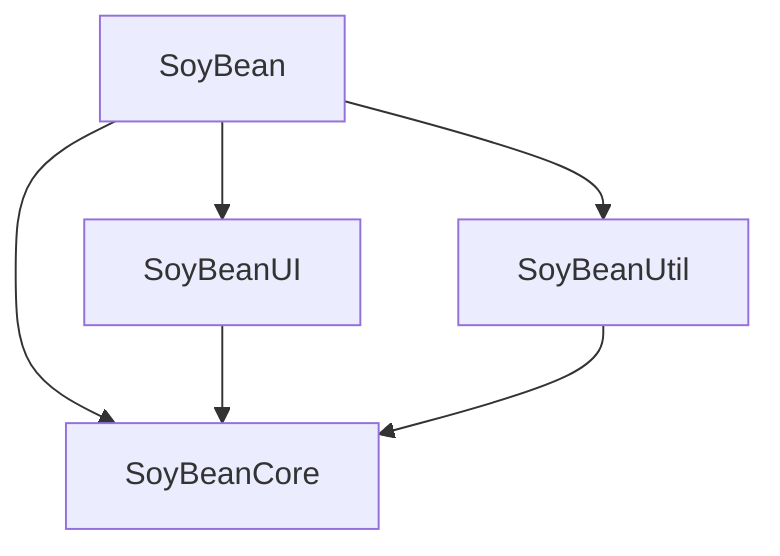

# SoyBean

SoyBean은 Apple 플랫폼 앱에서 반복적으로 사용하는 확장, 로깅, 포맷 변환, 유효성 검사, 보안 저장소 및 UI 컴포넌트를 모아 둔 Swift Package입니다. 외부 패키지 의존성 없이 필요한 모듈만 선택해서 사용할 수 있습니다.

## 요구 사항

| 항목 | 최소 사양 |
| --- | --- |
| Swift tools | 5.10 |
| iOS | 15 이상 |
| macOS | 12 이상 |
| watchOS | 8 이상 |

플랫폼은 위와 같이 선언되어 있지만 모든 API가 세 플랫폼에서 동일하게 제공되는 것은 아닙니다. UIKit API와 햅틱, 키보드 Publisher는 iOS 전용이며 AppKit API는 macOS 전용입니다. 공통 SwiftUI 컴포넌트는 각 API의 OS 버전 조건에 따라 사용할 수 있습니다.

## 설치

### Xcode에서 추가

1. `File > Add Package Dependencies`를 선택합니다.
2. 검색란에 다음 저장소 주소를 입력합니다.

   ```text
   https://github.com/GuTaeHo/SoyBean.git
   ```

3. 사용할 제품과 적용할 타깃을 선택한 뒤 `Add Package`를 누릅니다.


### Package.swift에서 추가

```swift
dependencies: [
    .package(url: "https://github.com/GuTaeHo/SoyBean.git", from: "1.2.21")
],
targets: [
    .target(
        name: "MyApp",
        dependencies: [
            .product(name: "SoyBean", package: "SoyBean")
        ]
    )
]
```

예시는 현재 저장소의 최신 태그인 `1.2.21`을 기준으로 합니다. 프로젝트 정책에 맞는 릴리스 버전이나 브랜치를 선택할 수 있습니다.

## 제공 제품

| 제품 | 역할 |
| --- | --- |
| `SoyBean` | 아래 세 모듈을 한 번에 다시 내보내는 통합 모듈 |
| `SoyBeanCore` | 오류, 로깅, Foundation·Swift·Combine 확장 |
| `SoyBeanUI` | SwiftUI 컴포넌트, 폰트 리소스, UIKit·AppKit 보조 기능 |
| `SoyBeanUtil` | 날짜 포맷, 정규식, JWT 디코딩, Keychain 및 앱 유틸리티 |

전체 기능이 필요하면 통합 제품 하나만 추가합니다.

```swift
import SoyBean
```

필요한 기능만 사용하려면 개별 제품을 추가하고 직접 import합니다.

```swift
import SoyBeanCore
import SoyBeanUI
import SoyBeanUtil
```

## 빠른 사용법

### 로그 출력

로그는 `DEBUG` 빌드에서 OSLog로 출력됩니다.

```swift
import SoyBeanCore

Log.info("화면 진입")
Log.debug(["page": "home"])
Log.error("요청 실패")
```

### 날짜 포맷 변환

```swift
import SoyBeanUtil

let now = FormatUtil.currentDate()
let displayDate = try FormatUtil.formatDate(
    "2026-07-21 14:30:00",
    to: .yy_Dot_MM_Dot_dd
)
```

### 문자열 유효성 검사

```swift
import SoyBeanUtil

let isEmail = RegExpUtil.evaluate(
    type: .email,
    compareWith: "user@example.com"
)

let isPassword = RegExpUtil.evaluate(
    type: .password(range: 8...20),
    compareWith: "password123"
)
```

### Keychain 저장과 조회

저장할 값은 `Codable`을 준수해야 합니다.

```swift
import SoyBeanUtil

KeychainManager.shared.save("access-token", forKey: "token")

let token = KeychainManager.shared.load(
    String.self,
    forKey: "token"
)
```

Keychain Sharing을 사용하는 경우 `groupAt`에 타깃에 등록된 Access Group을 전달합니다.

### 커스텀 폰트

`SoyBeanUI`에는 Pretendard, IBM Plex Sans KR 및 NanumSquareRound OTF 리소스가 포함되어 있습니다. 앱 진입 시 폰트를 등록한 다음 사용합니다.

```swift
import SwiftUI
import SoyBeanUI

@main
struct MyApp: App {
    init() {
        Font.registerFonts()
    }

    var body: some Scene {
        WindowGroup {
            Text("SoyBean")
                .textStyle(
                    fontType: .pretendardSemiBold,
                    fontSize: 18,
                    color: .primary
                )
        }
    }
}
```

### Toast

Toast는 iOS에서 UIKit, macOS에서 AppKit으로 구현되어 있습니다. 두 플랫폼 모두 중앙 또는 상단 표시, 자동 제거, `.negative` 타입의 흔들림 효과를 지원합니다. 햅틱은 iOS에서만 발생합니다.

#### UIKit

```swift
import SoyBeanUI

view.sbShowToast(
    message: "저장되었습니다.",
    duration: .short,
    isShowTop: true,
    type: .positive
)
```

`UIViewController`에서도 같은 메서드를 호출할 수 있습니다.

#### AppKit

```swift
import SoyBeanUI

view.sbShowToast(
    message: "저장하지 못했습니다.",
    duration: .long,
    isShowTop: false,
    type: .negative
)
```

`NSViewController`에서도 같은 메서드를 호출할 수 있습니다.

#### SwiftUI

기존 API는 값을 반환하는 View modifier가 아니라 토스트 표시를 실행하는 메서드이므로 버튼 액션과 같은 실행 시점에 호출합니다.

```swift
import SwiftUI
import SoyBeanUI

struct ContentView: View {
    var body: some View {
        Button("Toast 표시") {
            EmptyView().sbShowToast(
                message: "완료되었습니다.",
                type: .positive
            )
        }
    }
}
```

## 플랫폼별 기능

| 기능 | iOS | macOS | watchOS |
| --- | --- | --- | --- |
| Foundation·Swift 확장 | 지원 | 지원 | 지원 |
| 로깅과 일반 유틸리티 | 지원 | 지원 | 기반 Apple 프레임워크가 제공되는 범위에서 지원 |
| 공통 SwiftUI 컴포넌트 | 지원 | 지원 | API 버전 조건에 따라 지원 |
| 키보드 Publisher | 지원 | 미지원 | 미지원 |
| UIKit 확장과 햅틱 | 지원 | 미지원 | 미지원 |
| AppKit 보조 기능 | 미지원 | 지원 | 미지원 |
| Toast | UIKit | AppKit | 미지원 |

## 프로젝트 구조

```text
SoyBean
├── Package.swift
├── Sources
│   ├── SoyBean
│   │   └── Importer.swift
│   ├── SoyBeanCore
│   │   ├── Error
│   │   ├── Extension
│   │   ├── Logger
│   │   └── Protocol
│   ├── SoyBeanUI
│   │   ├── CustomEffect
│   │   ├── CustomView
│   │   ├── CustomViewModifier
│   │   ├── Extension
│   │   ├── Manager
│   │   ├── Protocol
│   │   └── Resources
│   └── SoyBeanUtil
│       ├── Manager
│       ├── Protocol
│       └── Util
└── Tests
    └── SoyBeanTests
```

모듈 의존 관계는 다음과 같습니다.



`SoyBeanCore`는 다른 하위 모듈에 의존하지 않습니다. UI와 유틸리티 모듈은 공통 타입 및 확장을 사용하기 위해 Core에만 의존합니다.

## 로컬 빌드

```sh
swift build
swift test
```

플랫폼 전용 코드를 수정했다면 해당 iOS 또는 macOS 타깃도 함께 컴파일하는 것을 권장합니다.
