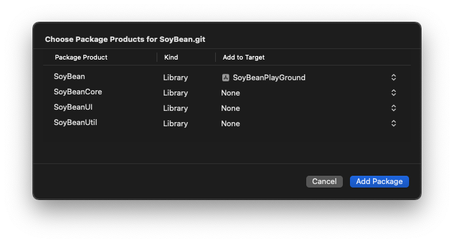
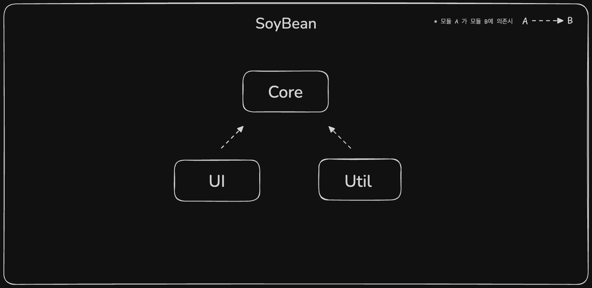

# SoyBean

포맷 변환, 정규식 체크, 로거 등 반복적으로 사용되는 기능을 제공하는 패키지

</br>
</br>

## 설치방법

```
Xcode > File > Add Package Dependencies > 
검색 란에 "https://github.com/GuTaeHo/SoyBean.git" 입력 > 
Add Package > 원하는 모듈과 적용될 타겟 설정 후 Add Package
```

하위 모듈을 전부 사용해야하는 경우 `SoyBean` 모듈만 추가해도 정상 동작



</br>
</br>


## 모듈간 의존성




</br>
</br>

## 모듈설명

### SoyBean

`Core`, `UI`, `Util` 을 모두 포함하고 있는 모듈

한번의 import 로 여러 모듈을 사용할 수 있다

</br>

**사용예시**

- 기존 3개 모듈 임포트

```swift
import SoyBeanCore
import SoyBeanUI
import SoyBeanUtil
```

- 1개만 임포트

```swift
import SoyBean
```

</br>
</br>

### SoyBeanCore

공통되면서 핵심적인 로직을 담고있는 모듈

</br>

- Error  
처리 중 발생된 에러가 정의된 디렉토리

- Extension  
Foundation 및 Swift 표준 라이브러리의 기존 타입(Date, String, Array ...)을 확장한 extension 구현

- Logger
Debug 빌드에서만 콘솔에 출력하는 로깅 메서드 구현

<br>
<br>

### SoyBeanUI

공통적으로 사용되는 UI 컴포넌트를 담고있는 모듈

<br>

- CustomView  
UIKit 또는 SwiftUI 의 뷰를 커스텀한 구현체 또는 지원되지않는 뷰 구현
- Extension  
UIKit 과 SwiftUI 의 기존 타입(UIView, UIColor, View ...)을 확장한 extension


<br>
<br>

### SoyBeanUtil
포맷 변환, 정규식 체크, 클립보드 와 키체인 등 유용한 유틸 클래스 구현

- Util  
날짜 및 시간 포맷 변환, 정규식 처리 또는 인코딩 및 디코딩, 클립보드나 외부 앱 접근 등의 유틸리티 정적 메소드 구현

- Manager  
Haptic 및 Keychain 기능을 제공하는 싱글톤 매니저 구현
